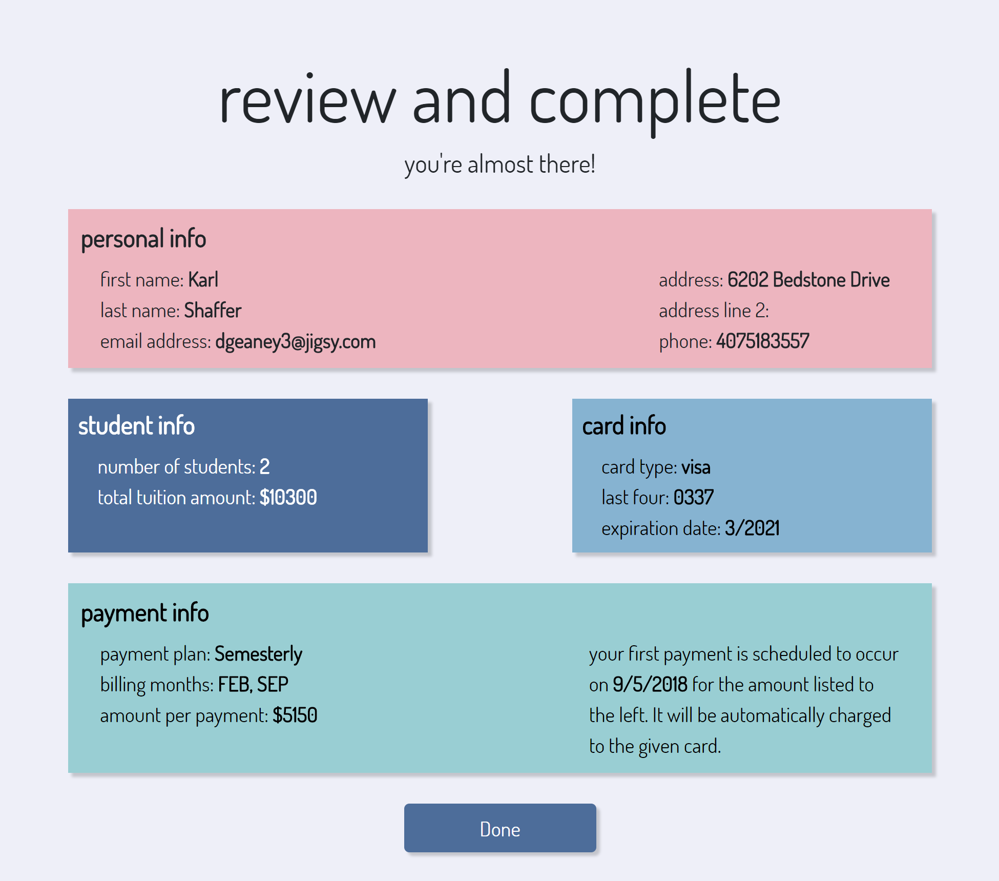
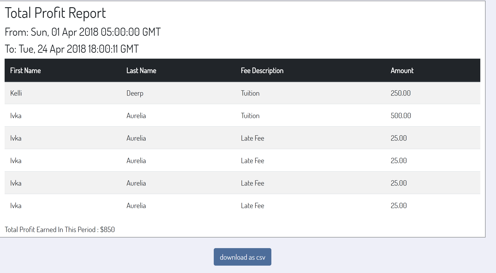

Gauri Ramesh <br>
Software Engineering Final Exam Part 1

## Code Sample #1: CSV Generation
To find this file in the code base, navigate to this [link](https://github.com/skmshaffer/RAIK383H-SoftwareEngineeringProject/blob/ffd6954de93d4a38dc496cc26d048c64288a7f84/NelnetProject/Utilities/CsvGenerator.cs).

CsvGenerator.cs
```CSharp
        public static byte[] GenerateCsv<T>(IList<T> itemsToWriteList, ClassMap map = null)
        {
            using (var memoryStream = new MemoryStream())
            {
                TextWriter writer = new StreamWriter(memoryStream);
                var csv = new CsvWriter(writer);
                var records = itemsToWriteList;

                if (map != null)
                {
                    csv.Configuration.RegisterClassMap(map);
                }

                csv.WriteRecords(records);
                writer.Flush();

                return memoryStream.ToArray();
            }
        }
```
Example of code chunk being used in the project: 

```CSharp
        public byte[] CreateReport(ReportPreferences preferences)
        {
            var recordsToWrite = CreateReportItemsFromDatabase(preferences);
            return CsvGenerator.GenerateCsv(recordsToWrite, new TotalProfitClassMap());
        }
```

Example of ClassMap used in `GenerateCsv` method:

```CSharp
public class TotalProfitReportItem
    {
        public string StudentFirstName { get; set; }
        public string StudentLastName { get; set; }
        public string FeeType { get; set; }
        public decimal Amount { get; set; }
    }

    public sealed class TotalProfitClassMap : ClassMap<TotalProfitReportItem>
    {
        public TotalProfitClassMap()
        {
            Map(m => m.StudentFirstName).Name("First Name");
            Map(m => m.StudentLastName).Name("Last Name");
            Map(m => m.FeeType).Name("Fee Description");
            Map(m => m.Amount).Name("Amount");
        }
    }
```

### About This Code Chunk
* Makes use of a third-party library called CsvHelper
* Adheres to single responsibility principle
* Prefers interfaces over their implementations by using an IList of items.
* Cleans up resources after usage

ResponseFactory.cs

```CSharp
    public class ResponseFactory
    {
        public static HttpResponseMessage ConstructCsvResponse(byte[] csvContentBytes)
        {
            var result = new HttpResponseMessage(HttpStatusCode.OK)
            {
                Content = new ByteArrayContent(csvContentBytes)
            };
            result.Content.Headers.ContentType = new MediaTypeHeaderValue("application/octet-stream");
            result.Content.Headers.ContentLength = csvContentBytes.Length;
            return result;
        }
    }
```

### About This Code Chunk
* TODO
* TODO
* TODO

## Code Sample #2 : Finding Closest Date Algorithm in JavaScript

To find this file in the codebase, navigate to this [link](https://github.com/skmshaffer/RAIK383H-SoftwareEngineeringProject/blob/master/NelnetProject/Web/Nelnet_UI/source/Utils/date-utils.js).
```JavaScript
const parseDateTime = (invoiceData) => {
    let dateParseArray = [];
    invoiceData.forEach(element => {
        let date = new Date((Date.parse(element.InvoiceDate.substring(0, 10))));
        dateParseArray.push(date);
    });

    let today = new Date();
    dateParseArray = dateParseArray.sort((a, b) => {
        let distanceA = Math.abs(today - a);
        let distanceB = Math.abs(today - b);
        return distanceA - distanceB;
    }).filter((d) => {
        return d - today > 0;
    });

    if (dateParseArray[0] === undefined) {
        return "";
    }

    const nextScheduledMonth = dateParseArray[0].getUTCMonth() + 1;
    const nextScheduledDay = dateParseArray[0].getUTCDate();
    const nextScheduledYear = dateParseArray[0].getUTCFullYear();
    const dateString = `${nextScheduledMonth}/${nextScheduledDay}/${nextScheduledYear}`;

    return dateString;
};

export { parseDateTime };

```

Code Chunk in Use:



### About this Code Chunk
* Uses JavaScript ES6 features (export)
* Uses a sorting algorithm to find the nearest date to today that is in the future.
* Adheres to single responsibility principle because all date-related functions are encapsulated in this utility class.

## Code Sample #3: Report Generation
Of all of the reports I generated, I chose to showcase the Total Profit Report Engine.

`TotalProfitReportEngine.cs`

```CSharp
    public class TotalProfitReportEngine : ITotalProfitReportEngine
    {
        private readonly IInvoiceAccessor _invoiceAccessor;
        private readonly IInvoiceItemAccessor _invoiceItemAccessor;
        private readonly IStudentAccessor _studentAccessor;

        public TotalProfitReportEngine(IInvoiceAccessor ia, IInvoiceItemAccessor it, IStudentAccessor sa)
        {
            _invoiceAccessor = ia;
            _invoiceItemAccessor = it;
            _studentAccessor = sa;
        }


        public byte[] CreateReport(ReportPreferences preferences)
        {
            var recordsToWrite = CreateReportItemsFromDatabase(preferences);
            return CsvGenerator.GenerateCsv(recordsToWrite, new TotalProfitClassMap());
        }

        public IList<TotalProfitReportItem> CreateReportItemsFromDatabase(ReportPreferences preferences)
        {
            var invoiceItems = _invoiceItemAccessor.Get();
            IList<TotalProfitReportItem> reportItems = new List<TotalProfitReportItem>();

            var startDate = DateTime.Parse(preferences.StartTime);
            var endDate = DateTime.Parse(preferences.EndTime);

            foreach (var invoiceItem in invoiceItems)
            {
                LoadInvoiceItem(invoiceItem);
                if (invoiceItem.Type == InvoiceItemType.BaseTuition || invoiceItem.Type == InvoiceItemType.LateFee)
                {
                    if (startDate <= invoiceItem.Invoice.InvoiceDate && endDate >= invoiceItem.Invoice.InvoiceDate)
                    {
                        var type = invoiceItem.Type;
                        type = StringUtils.ConvertConstantToTitleCase(type);

                        reportItems.Add(new TotalProfitReportItem
                        {
                            StudentFirstName = invoiceItem.Invoice.Student.FirstName,
                            StudentLastName = invoiceItem.Invoice.Student.LastName,
                            FeeType = type,
                            Amount = Math.Round(invoiceItem.Amount, 2)
                        });
                    }
                }
            }

            return reportItems;
        }

        public ReportTotal GetTotal(ReportPreferences preferences)
        {
            var totalProfitEarned = CreateReportItemsFromDatabase(preferences).Sum(profitItem => profitItem.Amount);
            return new ReportTotal
            {
                Amount = Math.Round(totalProfitEarned, 2),
                Description = "Total Profit Earned In This Period"
            };
        }

        private void LoadInvoiceItem(InvoiceItem invoiceItem)
        {
            invoiceItem.Invoice = _invoiceAccessor.Get(invoiceItem.Invoice.Id);
            var student = invoiceItem.Invoice.Student;

            if (student != null)
            {
                invoiceItem.Invoice.Student = _studentAccessor.Get(student.Id);
            }
        }
    }
```
Code Chunk in Use:


## Code Sample #3 : Converting CSV into an HTML Table 

```javascript
let CsvToHtmlTable = (data) => {
    let build = "<table class=\"table table-striped\">\n";
    let headAndBody = data.split("\n");
    // Construct the header
    build += "<tr>\n<thead class=\"thead-dark\">\n";
    let headElements = headAndBody[0].split(",");
    for (let i = 0; i < headElements.length; i++) {
        build += `<th>${headElements[i].toString()}</th>\n`;
    }
    build += "\n</thead>\n</tr>\n";

    // Construct the body
    for (let i = 1; i < headAndBody.length - 1; i++) {
        let rowElements = headAndBody[i].split(",");
        build += "<tr>\n";
        for (let i = 0; i < rowElements.length; i++) {
            let cellText = "";
            if (rowElements[i].toString().length > 0) {
                cellText = rowElements[i].toString();
            }
            build += `<td>${cellText}</td>\n`;
        }
        build += "</tr>\n";
    }
    build += "</table>";
    return build;
};

export default CsvToHtmlTable;
```


